# ezcapture

A Direct Show filter that can capture audio and video from the following devices

* [Magewell Pro Capture HDMI 4k Plus](https://www.magewell.com/products/pro-capture-hdmi-4k-plus) 
* [Magewell USB Capture](https://www.magewell.com/capture/usb-capture) (4k Pro and 4k Plus are known to work, 1080p cards should also work)
* [BlackMagic Decklink](https://www.blackmagicdesign.com/products/decklink)

Depends on LAVAudio being present in the graph to handle audio processing.

Supports 

* Linear PCM audio
* Non linear PCM audio (magewell pro pcie only)
* SDR and HDR video formats
* automatic reaction to audio codec changes or video format changes
* automatic refresh rate switching

There are no end user configuration options available as the filter is designed to capture the input as is and pass it downstream.

Note that such live updates to audio and video formats rely on the downstream filters (renderers, audio output) to accept dynamic format changes. This behaviour is supported by both JRiver and mpc-hc.

## Use with old CPUs

If your CPU does not support AVX2, download the `-noarch` variant only.

## Initial Installation

### Magewell

* Download the latest release from https://github.com/3ll3d00d/ezcapture/releases & unzip to some directory
* Execute MWCaptureRT.exe
* Open an admin cmd prompt in the directory
* Register the filter using `regsvr32`, e.g. `regsvr32 mwcapture.ax` or `regsvr32 mwcapture-trace.ax`

#### If using USB Capture Cards

Install the [USB Capture Utility](https://www.magewell.com/products/usb-capture-hdmi-4k-plus#detail_firmware)

4k+ users must set the following 3 formats in the advanced tab of the capture utility

* BGR24
* UYVY
* NV12

4k pro users should set these 3

* BGR24
* UYVY
* P010

See the [p38 of the manual](https://www.magewell.com/files/documents/User_Manual/USB-Capture-Utility-V3-user-manual_en_US.pdf) for details.

### Blackmagic

* Download the latest release from https://github.com/3ll3d00d/ezcapture/releases & unzip to some directory
* Download the latest Desktop Video installer from https://www.blackmagicdesign.com/nl/support/family/capture-and-playback and install it
* Open an admin cmd prompt in the directory
* Register the filter using `regsvr32`, e.g. `regsvr32 bmcapture.ax` or `regsvr32 bmcapture-trace.ax`

### Tested On

* Windows 10 and Windows 11
* [J River JRVR](https://wiki.jriver.com/index.php/JRVR_-_JRiver_Video_Renderer) in [MC34](https://yabb.jriver.com/interact/index.php/board,87.0.html)
* mpc-hc with [madvr b113 or below only](http://madshi.net/madVRhdrMeasure113.zip) or mpc-vr

## Configuration

### JRiver Media Center

Refer to the JRiver wiki for supporting information

* [features](https://wiki.jriver.com/index.php/Television)
* [setup guide](https://wiki.jriver.com/index.php/TV_Setup)
* [JRVR setup](https://wiki.jriver.com/index.php/JRVR_-_JRiver_Video_Renderer)

First, check the device is available in MC (Media Center)

* Go to Windows Device Manager > Sound, video and game controllers
* Check the magewell device is visible and take note of the name (00 Pro Capture HDMI 4k+ in this example)

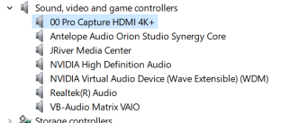

* Open MC
* Go to Television > TV Options > Manage Devices, there should be at least 2 devices visible
    * the magewell device filter
    * mwcapture filter (aka `Magewell Pro Capture` or `Magewell Pro Capture (Trace)`

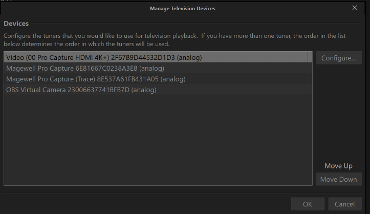

Next, make each filter available as a channel

* go to Television > TV Options > Manage Channels
* click `Add Channel` for each listed device using the following values
    * Type = Camera
    * Name = free text of your choice
    * Device = `Magewell Pro Capture`

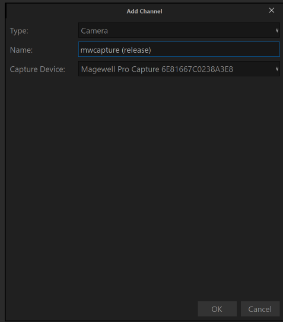

To play using the filter, just start playback of the specified channel & configure JRVR as required.

The same process applies for blackmagic cards except the filter will be named `Blackmagic Capture` or `Blackmagic Capture (Trace)`.

## Logging

The with-logging variants writes information to a log file which can be found in`%TEMP%`, the filename will be `MagewellTrace_YYYYMMSS_HHMMSS.log` or `BlackmagicTrace_YYYYMMDD_HHMMSS.log`.

Frame timing statistics are captured to csv files in the same directory (`MagewellTrace_audio_latency_YYYYMMSS.csv` or `BlackmagicTrace_audio_latency_YYYYMMSS.csv`).

## Investigating Issues

Most issues require an understanding of what signal is presented to the filter. There are 2 common ways to achieve this.

### Magewell

#### Using the mwcapture property page

This is accessible after playback starts via the right click menu (DirectShow Filters option)

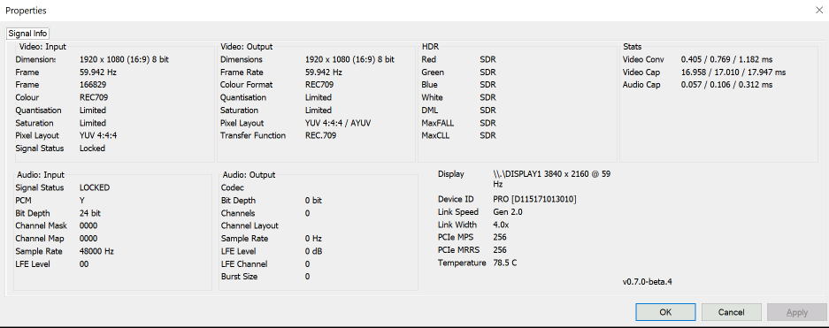

#### Using the Magewell provided driver

> :warning: These are only available when using the magewell filter, they are **NOT** available using mwcapture

Pages 15 & 19-23 of the [official installation guide](https://www.magewell.com/files/ProCapture-User-Manual.pdf) provide full detail of the information provided.

To access the property pages in MC

* start playback using the Magewell filter
* right click on the displayed picture
* navigate to the video filter via DirectShow filters and left click 

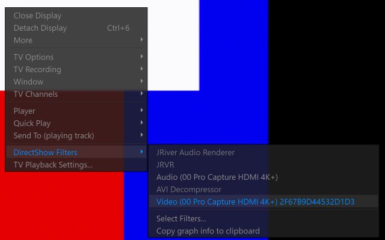

#### SDR 

HDMI InfoFrame

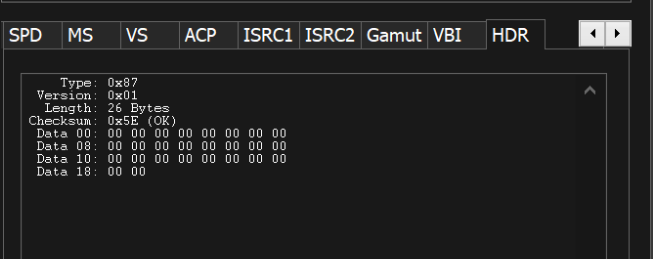

Video Signal

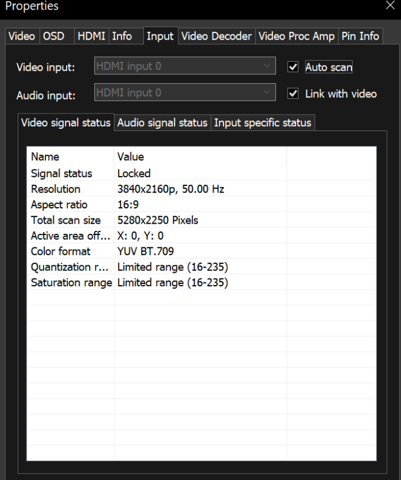

Input Signal

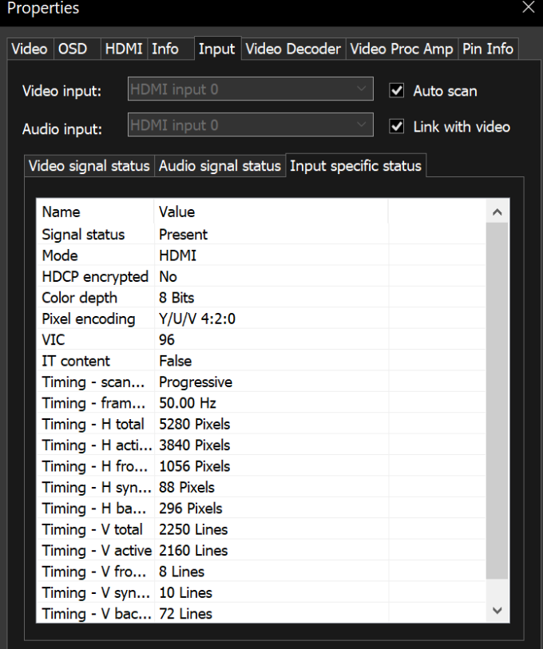

results in the following JRVR OSD

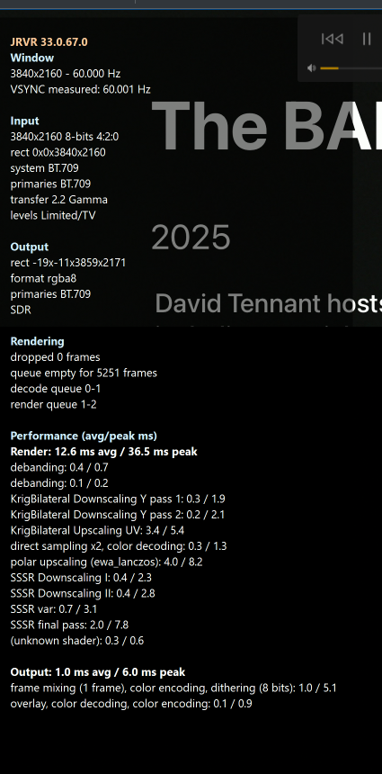

#### HDR 

HDMI InfoFrame

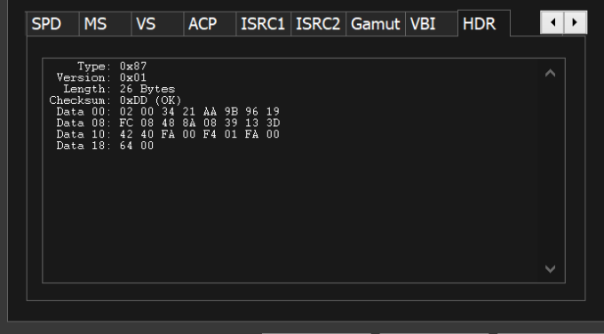

Video Signal

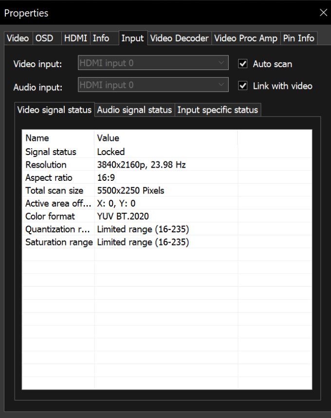

Input Signal

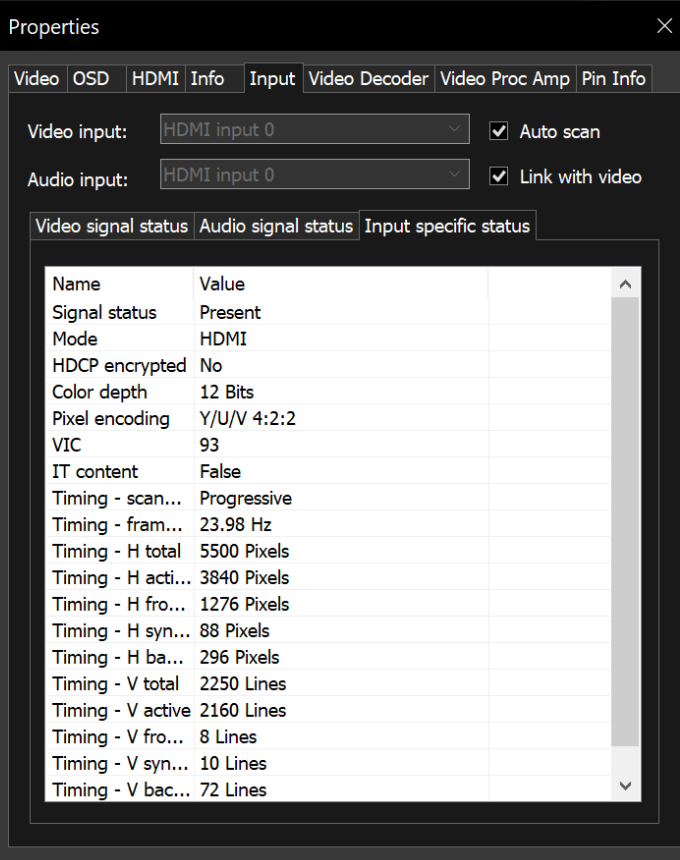

results in the following JRVR OSD

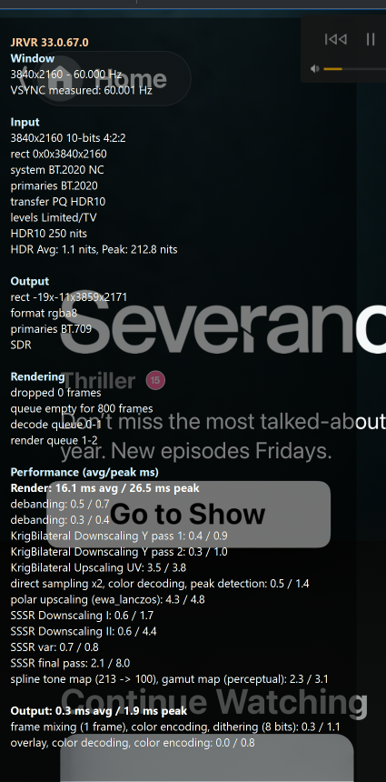

### mwcapture logs

> :warning: These logs are generated when using mwcapture, they are **NOT** available using the magewell filter

Start playback using the release-trace filter and examine the log file, sample log sections for different events are shown below

#### No Signal is present

```
14:19:20.172688061 [175076] mwcapture.cpp:1454           LOG_TRACE_L1  filter       [VideoCapture] Timeout and no signal, get delivery buffer for no signal image
14:19:20.173469856 [175076] mwcapture.cpp:1154           LOG_ERROR     filter       [VideoCapture] LoadSignal MWGetInputSpecificStatus is invalid, will display no/unsupported signal image
```

#### Video Format Changed Successfully

```
14:19:50.853168512 [175076] capture.cpp:1065             LOG_INFO      filter       [VideoCapture] Video dimension change 720x480 to 1920x1080
14:19:50.853169675 [175076] capture.cpp:1084             LOG_INFO      filter       [VideoCapture] Video FPS change 50.000 to 59.942
14:19:50.853170266 [175076] capture.cpp:1093             LOG_INFO      filter       [VideoCapture] Video pixel format change BGR  to AYUV
14:19:50.853170626 [175076] capture.cpp:1102             LOG_INFO      filter       [VideoCapture] Video colour format change RGB to REC709
14:19:50.853170847 [175076] capture.cpp:1115             LOG_INFO      filter       [VideoCapture] Video colorimetry change quant 1 to 2 sat 1 to 2
14:19:50.853170917 [175076] capture.h:1085               LOG_WARNING   filter       [VideoCapture] VideoFormat changed! Attempting to reconnect
14:19:50.853174454 [175076] capture.cpp:1155             LOG_WARNING   filter       [VideoCapture] Proposing new video format 1920 x 1080 (16:9) @ 59.942 Hz in 8 bits (AYUV REC709 tf: 4) size 8294400 bytes
14:19:50.861201967 [175076] capture.h:81                 LOG_WARNING   filter       [VideoCapture] VideoCapturePin::CheckMediaType VIH2 32,2048,1080,8847360,AYUV
14:19:50.861937438 [175076] capture.cpp:840              LOG_TRACE_L1  filter       [VideoCapture] CapturePin::RenegotiateMediaType ReceiveConnection succeeded [0x000000]
14:19:50.861938380 [175076] capture.h:81                 LOG_WARNING   filter       [VideoCapture] VideoCapturePin::SetMediaType VIH2 32,1920,1080,8294400,AYUV
14:19:50.861939332 [175076] capture.cpp:965              LOG_TRACE_L1  filter       [VideoCapture] CapturePin::NegotiateMediaType succeeded
```

#### Video Format Changes to HDR

```
21:13:30.753099802 [73016] mwcapture.cpp:1495           LOG_INFO      filter       [Capture] HDR metadata is now present
21:13:30.753100754 [73016] mwcapture.cpp:1503           LOG_INFO      filter       [Capture] Primaries RGB 34000 x 16000 13250 x 34500 7500 x 3000
21:13:30.753101064 [73016] mwcapture.cpp:1508           LOG_INFO      filter       [Capture] Whitepoint 15635 x 16450
21:13:30.753101325 [73016] mwcapture.cpp:1513           LOG_INFO      filter       [Capture] DML/MaxCLL/MaxFALL 50 / 1000 854 289
21:13:30.753101495 [73016] mwcapture.cpp:1608           LOG_INFO      filter       [Capture] Video dimension change 720x480 to 3840x2160
21:13:30.753101605 [73016] mwcapture.cpp:1625           LOG_INFO      filter       [Capture] Video FPS change 50 to 23
21:13:30.753101666 [73016] mwcapture.cpp:1633           LOG_INFO      filter       [Capture] Video bit depth change 8 to 12
21:13:30.753101726 [73016] mwcapture.cpp:1643           LOG_INFO      filter       [Capture] Video pixel encoding change 0 to 1
21:13:30.753101786 [73016] mwcapture.cpp:1651           LOG_INFO      filter       [Capture] Video colour format change RGB to YUV2020
21:13:30.753101936 [73016] mwcapture.cpp:1662           LOG_INFO      filter       [Capture] Video colorimetry change quant 1 to 2 sat 1 to 2
21:13:30.753102036 [73016] mwcapture.cpp:1674           LOG_INFO      filter       [Capture] Video transfer function change REC.709 (4) to SMPTE ST 2084 (PQ) (15)
21:13:30.753102477 [73016] mwcapture.cpp:1880           LOG_WARNING   filter       [Capture] VideoFormat changed! Attempting to reconnect
21:13:30.753103769 [73016] mwcapture.cpp:1771           LOG_WARNING   filter       [Capture] Proposing new video format 3840 x 2160 (16:9) @ 23 Hz in 12 bits (P210 YUV2020 tf: 15) size 33177600 bytes
21:13:30.753841967 [73016] mwcapture.cpp:827            LOG_TRACE_L1  filter       [Capture] MagewellCapturePin::RenegotiateMediaType ReceiveConnection accepted
21:13:30.753842658 [73016] mwcapture.cpp:939            LOG_TRACE_L1  filter       [Capture] MagewellCapturePin::NegotiateMediaType succeeded
```

#### HDR Metadata is sent downstream

```
21:13:30.878061562 [73016] mwcapture.cpp:1189           LOG_TRACE_L1  filter       [Capture] Updating HDR meta in frame 1659, last update at 0
21:13:30.878095650 [73016] mwcapture.cpp:1233           LOG_TRACE_L1  filter       [Capture] HDR meta: R 0.6800 0.3200
21:13:30.878096000 [73016] mwcapture.cpp:1235           LOG_TRACE_L1  filter       [Capture] HDR meta: G 0.2650 0.6900
21:13:30.878096010 [73016] mwcapture.cpp:1237           LOG_TRACE_L1  filter       [Capture] HDR meta: B 0.1500 0.0600
21:13:30.878096020 [73016] mwcapture.cpp:1239           LOG_TRACE_L1  filter       [Capture] HDR meta: W 0.3127 0.3290
21:13:30.878096091 [73016] mwcapture.cpp:1241           LOG_TRACE_L1  filter       [Capture] HDR meta: DML 0.005 1000
21:13:30.878096111 [73016] mwcapture.cpp:1243           LOG_TRACE_L1  filter       [Capture] HDR meta: MaxCLL/MaxFALL 854 289
```

#### Audio Format changed successfully

```
21:13:31.525123574 [73824] mwcapture.cpp:3447           LOG_INFO      filter       [AudioCapture] Input channel count change 2 to 8
21:13:31.525123754 [73824] mwcapture.cpp:3456           LOG_INFO      filter       [AudioCapture] Output channel count change 2 to 8
21:13:31.525124435 [73824] mwcapture.cpp:3473           LOG_INFO      filter       [AudioCapture] Fs change 44100 to 48000
21:13:31.525124646 [73824] mwcapture.cpp:3489           LOG_INFO      filter       [AudioCapture] Channel allocation change 0 to 19
21:13:31.525124706 [73824] mwcapture.cpp:4144           LOG_WARNING   filter       [AudioCapture] AudioFormat changed! Attempting to reconnect
21:13:31.525128954 [73824] mwcapture.cpp:3799           LOG_WARNING   filter       [AudioCapture] Proposing new audio format Fs: 48000 Bits: 16 Channels: 8 Codec: PCM
21:13:31.525136428 [73824] mwcapture.cpp:865            LOG_TRACE_L1  filter       [AudioCapture] MagewellCapturePin::NegotiateMediaType QueryAccept accepted
21:13:31.525169249 [73824] mwcapture.cpp:896            LOG_TRACE_L1  filter       [AudioCapture] Updated allocator to 3072 bytes 16 buffers
21:13:31.525169320 [73824] mwcapture.cpp:939            LOG_TRACE_L1  filter       [AudioCapture] MagewellCapturePin::NegotiateMediaType succeeded
```

#### Successful change to non linear PCM

```
21:22:28.277013911 [75400] mwcapture.cpp:4035           LOG_TRACE_L2  filter       [AudioCapture] Reading frame 204
21:22:28.277014543 [75400] mwcapture.cpp:4054           LOG_TRACE_L2  filter       [AudioCapture] Bitstream probe in frame 204 - PCM 48000 Hz (since: 0 len: 19 burst: 0)
21:22:28.280307731 [75400] mwcapture.cpp:4035           LOG_TRACE_L2  filter       [AudioCapture] Reading frame 205
21:22:28.280309193 [75400] mwcapture.cpp:4054           LOG_TRACE_L2  filter       [AudioCapture] Bitstream probe in frame 205 - PCM 48000 Hz (since: 1 len: 19 burst: 0)
21:22:28.284296155 [75400] mwcapture.cpp:4035           LOG_TRACE_L2  filter       [AudioCapture] Reading frame 206
21:22:28.284296866 [75400] mwcapture.cpp:4054           LOG_TRACE_L2  filter       [AudioCapture] Bitstream probe in frame 206 - PCM 48000 Hz (since: 2 len: 19 burst: 0)
21:22:28.288258032 [75400] mwcapture.cpp:4035           LOG_TRACE_L2  filter       [AudioCapture] Reading frame 207
21:22:28.288258282 [75400] mwcapture.cpp:4054           LOG_TRACE_L2  filter       [AudioCapture] Bitstream probe in frame 207 - PCM 48000 Hz (since: 3 len: 19 burst: 0)
21:22:28.292278975 [75400] mwcapture.cpp:4035           LOG_TRACE_L2  filter       [AudioCapture] Reading frame 208
21:22:28.292279836 [75400] mwcapture.cpp:4054           LOG_TRACE_L2  filter       [AudioCapture] Bitstream probe in frame 208 - PCM 48000 Hz (since: 4 len: 19 burst: 0)
21:22:28.296255313 [75400] mwcapture.cpp:4035           LOG_TRACE_L2  filter       [AudioCapture] Reading frame 209
21:22:28.296255994 [75400] mwcapture.cpp:4054           LOG_TRACE_L2  filter       [AudioCapture] Bitstream probe in frame 209 - PCM 48000 Hz (since: 5 len: 19 burst: 0)
21:22:28.300323724 [75400] mwcapture.cpp:4035           LOG_TRACE_L2  filter       [AudioCapture] Reading frame 210
21:22:28.300324075 [75400] mwcapture.cpp:4054           LOG_TRACE_L2  filter       [AudioCapture] Bitstream probe in frame 210 - PCM 48000 Hz (since: 6 len: 19 burst: 0)
21:22:28.300325968 [75400] mwcapture.cpp:4280           LOG_TRACE_L2  filter       [AudioCapture] Found PaPb at position 652-656 (5263 since last)
21:22:28.300326660 [75400] mwcapture.cpp:4364           LOG_TRACE_L2  filter       [AudioCapture] Found codec AC3 with burst size 1536
21:22:28.300327311 [75400] mwcapture.cpp:4065           LOG_TRACE_L2  filter       [AudioCapture] Detected bitstream in frame 210 PCM (res: 0x000002)
21:22:28.304325313 [75400] mwcapture.cpp:4035           LOG_TRACE_L2  filter       [AudioCapture] Reading frame 211
21:22:28.304329501 [75400] mwcapture.cpp:4065           LOG_TRACE_L2  filter       [AudioCapture] Detected bitstream in frame 211 AC3 (res: 0x000002)
21:22:28.308317378 [75400] mwcapture.cpp:4035           LOG_TRACE_L2  filter       [AudioCapture] Reading frame 212
21:22:28.308320273 [75400] mwcapture.cpp:4065           LOG_TRACE_L2  filter       [AudioCapture] Detected bitstream in frame 212 AC3 (res: 0x000000)
21:22:28.308320604 [75400] mwcapture.cpp:3481           LOG_INFO      filter       [AudioCapture] Codec change PCM to AC3
21:22:28.308320864 [75400] mwcapture.cpp:4144           LOG_WARNING   filter       [AudioCapture] AudioFormat changed! Attempting to reconnect
21:22:28.308325413 [75400] mwcapture.cpp:3799           LOG_WARNING   filter       [AudioCapture] Proposing new audio format Fs: 48000 Bits: 16 Channels: 2 Codec: AC3
21:22:28.308331594 [75400] mwcapture.cpp:865            LOG_TRACE_L1  filter       [AudioCapture] MagewellCapturePin::NegotiateMediaType QueryAccept accepted
21:22:28.308363234 [75400] mwcapture.cpp:896            LOG_TRACE_L1  filter       [AudioCapture] Updated allocator to 1536 bytes 16 buffers
21:22:28.308363645 [75400] mwcapture.cpp:939            LOG_TRACE_L1  filter       [AudioCapture] MagewellCapturePin::NegotiateMediaType succeeded
```

